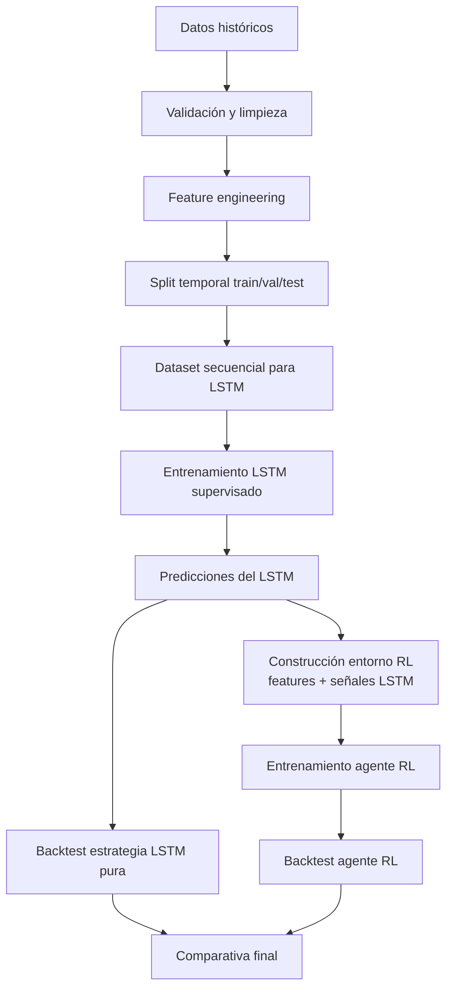

# Documento maestro — Sistema de trading con LSTM + aprendizaje por refuerzo posterior en un único script Python con NiceGUI

## 0. Propósito del documento

Este documento sirve como especificación maestra para construir, mantener y evolucionar una aplicación de trading algorítmico basada en:

1. Un modelo supervisado LSTM entrenado sobre datos históricos de mercado.
2. Una fase posterior de aprendizaje por refuerzo que aprenda una política de decisión usando las predicciones/señales del modelo LSTM y el estado del mercado.
3. Una interfaz visual hecha con NiceGUI.
4. Un único archivo Python ejecutable, manteniendo una arquitectura interna limpia mediante clases, funciones y secciones bien delimitadas.

El documento también debe seguir usándose como registro vivo de decisiones, cambios, fixes, bugs conocidos, mejoras pendientes y criterios de aceptación.

---

## Índice

- [1. Prompt maestro para agentes de IA](#1-prompt-maestro-para-codex--agente-de-programación)
- [2. Alcance funcional](#2-alcance-funcional-del-sistema)
- [3. Restricciones técnicas](#3-restricciones-técnicas)
- [4. Librerías y versiones](#4-librerías-y-versiones)
- [5. Arquitectura conceptual](#5-arquitectura-conceptual)
- [6. Especificación del modelo LSTM](#6-especificación-del-modelo-lstm)
- [7. Especificación del backtester](#7-especificación-del-backtester)
- [8. Especificación del entorno RL](#8-especificación-del-entorno-rl)
- [9. Consideraciones teóricas y políticas de modelado](#9-consideraciones-teóricas-y-políticas-de-modelado)
- [10. Especificación de la interfaz NiceGUI](#10-especificación-de-la-interfaz-nicegui)
- [11. Estructura de clases sugerida](#11-estructura-de-clases-sugerida)
- [12. Requisitos de calidad](#12-requisitos-de-calidad)
- [13. Quick start](#13-quick-start-flujo-mínimo-verificable)
- [14. Limitaciones explícitas](#14-limitaciones-explícitas)
- [15. Criterios de aceptación](#15-criterios-de-aceptación)
- [16. Plan de implementación](#16-plan-de-implementación)
- [17. Instrucciones específicas de implementación](#17-instrucciones-específicas-de-implementación)
- [18. Recomendaciones de hiperparámetros](#18-recomendaciones-iniciales-de-hiperparámetros)
- [19. Registro vivo](#19-registro-vivo-cambios-bugs-y-decisiones)
- [20. Riesgos técnicos](#20-riesgos-técnicos-principales)
- [21. Próximos cambios](#21-próximos-cambios-sugeridos)
- [22. Glosario](#22-glosario)

---

## 1. Prompt maestro para Codex / agente de programación

### Rol

Actúa como un ingeniero senior de software especializado en Python, machine learning aplicado a series temporales financieras, trading algorítmico, PyTorch, aprendizaje por refuerzo, Gymnasium, Stable-Baselines3 y desarrollo de interfaces con NiceGUI.

Tu objetivo es construir una aplicación completa, robusta, mantenible y extensible en **un único script de Python** que permita entrenar un modelo LSTM para trading y, posteriormente, entrenar un agente de aprendizaje por refuerzo que use el modelo entrenado como parte del entorno o de las señales disponibles.

No debes limitarte a crear una demo superficial. Debes construir una base sólida, modular y preparada para evolucionar.

### Contexto del proyecto

Quiero una aplicación local para investigación y prototipado de estrategias de trading. La aplicación debe permitir cargar o descargar datos históricos de mercado, preparar features, entrenar un modelo LSTM, evaluar su rendimiento, crear un entorno de trading simulado y entrenar posteriormente un agente de aprendizaje por refuerzo.

La aplicación debe estar implementada en **un solo archivo Python**, por ejemplo:

```bash
trading_lstm_rl_app.py
```

Aunque sea un único archivo, debe estar organizado internamente con secciones claras, clases, dataclasses, funciones puras y separación lógica de responsabilidades.

La interfaz debe estar hecha con **NiceGUI**. La aplicación debe ejecutarse localmente y abrirse en el navegador.

El sistema debe priorizar:

- Claridad arquitectónica.
- Robustez.
- Trazabilidad de experimentos.
- Evitar leakage de datos.
- Separación estricta entre entrenamiento, validación y test.
- Backtesting realista con costes, comisiones, slippage y control de riesgo.
- Registro de métricas y logs.
- Facilidad para modificar hiperparámetros desde la UI.
- Persistencia de modelos y configuración.
- Capacidad de reentrenar y comparar experimentos.

---

## 2. Alcance funcional del sistema

### 2.1. Funcionalidades mínimas obligatorias

La aplicación debe incluir las siguientes capacidades:

0. **Datos de ejemplo**
   - Incluir un CSV de ejemplo con datos OHLCV diarios de SPY (2018-01-01 a 2023-12-31) descargable desde la UI como fallback si el usuario no tiene datos.
   - Alternativa: añadir botón "Descargar datos de ejemplo" que use `yfinance` para obtener SPY automáticamente.

1. **Carga de datos**
   - Cargar CSV local.
   - Opcionalmente descargar datos usando una fuente sencilla, por ejemplo `yfinance`, si está disponible.
   - Validar columnas mínimas: `Date`, `Open`, `High`, `Low`, `Close`, `Volume`.
   - Ordenar cronológicamente.
   - Eliminar duplicados.
   - Detectar huecos temporales.
   - Mostrar resumen de datos en la UI.

2. **Preparación de datos**
   - Calcular retornos.
   - Calcular volatilidad rolling.
   - Calcular medias móviles.
   - Calcular RSI, MACD o indicadores técnicos básicos.
   - Normalizar/scalar features sin fuga de datos.
   - Crear ventanas temporales para LSTM.
   - Separar train/validation/test por orden temporal (70/15/15 por defecto).

3. **Modelo LSTM supervisado**
   - Implementar modelo en PyTorch.
   - Entrada: secuencias temporales de features.
   - Salida configurable:
     - regresión del retorno futuro, o
     - clasificación de dirección: subir/bajar/neutro.
   - Entrenamiento con early stopping.
   - Guardado de pesos.
   - Carga de modelo entrenado.
   - Métricas de entrenamiento y validación.
   - Gráficos de loss.
   - Evaluación sobre test.

4. **Generación de señales con LSTM**
   - Convertir predicciones en señales interpretables.
   - Señales posibles:
     - Long.
     - Short.
     - Flat.
   - Umbrales configurables.
   - Mostrar distribución de señales.

5. **Backtesting básico del modelo LSTM**
   - Simular estrategia basada en señales del LSTM.
   - Incluir comisiones.
   - Incluir slippage.
   - Incluir stop loss y take profit simples.
   - Calcular métricas:
     - retorno total,
     - CAGR si aplica,
     - drawdown máximo,
     - Sharpe aproximado,
     - Sortino aproximado,
     - win rate,
     - profit factor,
     - número de operaciones,
     - exposición al mercado.

6. **Entorno de aprendizaje por refuerzo**
   - Implementar un entorno compatible con Gymnasium.
   - El entorno debe simular trading sobre los datos históricos.
   - El estado debe incluir:
     - features de mercado,
     - posición actual,
     - equity actual o drawdown,
     - predicción/señal del LSTM,
     - volatilidad reciente,
     - información de riesgo.
   - Acciones mínimas:
     - 0 = mantener/flat,
     - 1 = long,
     - 2 = short.
   - Opcionalmente acciones ampliadas:
     - reducir posición,
     - aumentar posición,
     - cerrar posición.
   - La recompensa debe considerar retorno neto, costes, drawdown y riesgo.

7. **Entrenamiento RL posterior**
   - Usar Stable-Baselines3 si está disponible.
   - Algoritmo inicial recomendado: PPO.
   - Permitir configurar timesteps.
   - Guardar agente entrenado.
   - Evaluar agente entrenado en periodo test separado.
   - Comparar contra:
     - buy and hold,
     - estrategia LSTM pura,
     - estrategia RL.

8. **Interfaz NiceGUI**
   - Pantalla principal con pestañas o secciones:
     - Datos.
     - Features.
     - Entrenamiento LSTM.
     - Evaluación LSTM.
     - Backtest LSTM.
     - Entrenamiento RL.
     - Backtest RL.
     - Experimentos/logs.
   - Botones para ejecutar cada etapa.
   - Campos configurables para hiperparámetros.
   - Mostrar logs en tiempo real o semitiempo real.
   - Mostrar tablas de métricas.
   - Mostrar gráficos básicos usando matplotlib/plotly si procede.
   - Permitir guardar configuración.

9. **Persistencia**
   - Guardar modelos en carpeta `models/`.
   - Guardar resultados en `runs/`.
   - Guardar configuración en JSON.
   - Guardar logs en texto.
   - Guardar métricas por experimento.

10. **Modo seguro de prototipo**
    - La aplicación no debe ejecutar órdenes reales de compra/venta.
    - Todo debe funcionar en modo simulación/backtesting.
    - Cualquier futura conexión a broker debe quedar claramente fuera de alcance o aislada detrás de una interfaz simulada.

---

## 3. Restricciones técnicas

### 3.1. Restricción principal

Todo el sistema debe estar en un único script Python.

Ejemplo:

```bash
python trading_lstm_rl_app.py
```

### 3.2. Organización interna obligatoria

Aunque sea un único archivo, debe dividirse mediante comentarios de sección:

```python
# ============================================================
# 1. Imports and global configuration
# ============================================================

# ============================================================
# 2. Dataclasses and configuration schemas
# ============================================================

# ============================================================
# 3. Data loading and validation
# ============================================================

# ============================================================
# 4. Feature engineering
# ============================================================

# ============================================================
# 5. Dataset creation for LSTM
# ============================================================

# ============================================================
# 6. PyTorch LSTM model
# ============================================================

# ============================================================
# 7. Supervised training loop
# ============================================================

# ============================================================
# 8. Prediction and signal generation
# ============================================================

# ============================================================
# 9. Backtesting engine
# ============================================================

# ============================================================
# 10. Gymnasium trading environment
# ============================================================

# ============================================================
# 11. RL training and evaluation
# ============================================================

# ============================================================
# 12. Experiment persistence and logging
# ============================================================

# ============================================================
# 13. NiceGUI interface
# ============================================================

# ============================================================
# 14. Main entry point
# ============================================================
```

### 3.3. Formato esperado del CSV de entrada

El CSV debe cumplir el siguiente contrato. Si no lo cumple, la UI debe mostrar un error descriptivo indicando qué columna falta o qué formato es incorrecto.

- **Columnas obligatorias**: `Date`, `Open`, `High`, `Low`, `Close`, `Volume` (case-insensitive: se aceptan también `date`, `open`, `high`, `low`, `close`, `volume`).
- **Formato de fecha**: `YYYY-MM-DD`. Si se detecta otro formato (ej. `DD/MM/YYYY`), intentar parseo automático con `pd.to_datetime(..., dayfirst=True)` y advertir en logs.
- **Separador**: coma (`,`). Si el parser falla, reintentar con punto y coma (`;`) y tabulador (`\t`).
- **Encoding**: UTF-8. Si falla, reintentar con `latin-1` y `ISO-8859-1`.
- **Orden**: las filas deben estar en orden cronológico ascendente. Si no lo están, la app las reordenará y lo registrará en logs.
- **Frecuencia**: diaria (1 fila por día de mercado). Si se detectan huecos (días sin fila), la UI debe mostrar un aviso con el número y rango de huecos. No se imputan automáticamente; se descartan del pipeline para LSTM.
- **Valores nulos**: cualquier fila con `NaN` en columnas OHLCV se descarta con advertencia.

---

## 4. Librerías y versiones

### 4.1. Dependencias

El script debe intentar usar las siguientes librerías. Se recomienda fijar versiones para evitar roturas silenciosas:

```text
pandas>=2.0,<3.0
numpy>=1.24,<2.0
scikit-learn>=1.3,<1.6
torch>=2.0,<3.0
matplotlib>=3.7,<4.0
nicegui>=1.4,<3.0
gymnasium>=0.29,<1.1
stable-baselines3>=2.0,<3.0
yfinance>=0.2,<1.0
```

Incluir un `requirements.txt` junto al script con estas versiones.

### 4.2. Degradación graceful por librería ausente

El script debe detectar qué librerías están disponibles al arrancar y adaptar la UI:

| Librería ausente | Comportamiento |
|---|---|
| `torch` | **Bloquear** la pestaña de Entrenamiento LSTM. Mostrar mensaje: _"PyTorch no está instalado. Ejecuta: pip install torch"_. El resto de la app (datos, features) sigue funcionando. |
| `gymnasium` | **Bloquear** las pestañas de Entrenamiento RL y Backtest RL. Mensaje: _"Gymnasium no está instalado. Ejecuta: pip install gymnasium"_. |
| `stable-baselines3` | **Ocultar** la pestaña de Entrenamiento RL. La de Backtest RL se mantiene en modo "solo LSTM". Mensaje: _"Stable-Baselines3 no está instalado. Ejecuta: pip install stable-baselines3 para habilitar RL"_. |
| `yfinance` | **Ocultar** el botón de descarga. Solo se permite carga CSV. Mensaje sutil en la pestaña Datos: _"yfinance no disponible — solo carga CSV"_. |
| `matplotlib` | **Desactivar** gráficos. Mostrar las métricas en tabla pero sin equity curve. Mensaje: _"matplotlib no está instalado. Los gráficos no estarán disponibles"_. |
| `nicegui` | **Error fatal** al arrancar. El script ni siquiera carga. Es la única dependencia irrenunciable. |

---

## 5. Arquitectura conceptual

### 5.1. Flujo general



### 5.2. Principio importante

El modelo LSTM no debe ser entrenado usando datos futuros. El agente RL tampoco debe evaluar sobre datos que hayan sido usados para ajustar hiperparámetros. La separación temporal debe respetarse siempre.

---

## 6. Especificación del modelo LSTM

### 6.1. Entrada

Tensor de forma:

```python
(batch_size, sequence_length, num_features)
```

Usar `batch_first=True` en PyTorch para simplificar.

### 6.2. Features sugeridas

Features mínimas:

- Close normalizado.
- Retorno porcentual.
- Volumen normalizado.
- Media móvil corta.
- Media móvil larga.
- Distancia del precio a media móvil.
- Volatilidad rolling.
- RSI.
- MACD.
- High-Low range.
- Open-Close range.

**Manejo de bordes temporales**: los indicadores que requieren ventana histórica (medias móviles, RSI, MACD, volatilidad rolling) producen `NaN` en las primeras `max(lookback)` filas. Estas filas deben descartarse del dataset antes de construir las secuencias LSTM. No se imputan. El número de filas descartadas debe mostrarse en logs y en la UI bajo "Features → Filas descartadas".

### 6.3. Target supervisado

Opción inicial recomendada: clasificación de dirección.

```text
0 = bajista
1 = neutral
2 = alcista
```

**Esta codificación es consistente en todo el sistema**: el modelo LSTM, el generador de señales y el entorno RL usan la misma asignación. No mezclar con otros esquemas.

Criterio:

- Si retorno futuro > umbral positivo → alcista (clase 2).
- Si retorno futuro < umbral negativo → bajista (clase 0).
- En caso contrario → neutral (clase 1).

Umbrales por defecto: `±0.01` (1%). Configurables en `LSTMConfig`.

### 6.4. Arquitectura inicial

```text
Input sequence
   ↓
LSTM layer(s)
   ↓
Dropout
   ↓
Linear layer
   ↓
Output logits / prediction
```

### 6.5. Criterios mínimos de entrenamiento

- Mostrar train loss y validation loss.
- Guardar mejor modelo por validation loss.
- Early stopping.
- Control de seed.
- Uso de CPU/GPU si está disponible.
- **Prohibido hacer shuffle que mezcle ventanas de train/val/test.** El split temporal es sacrosanto: train solo contiene fechas anteriores a val, y val anteriores a test. Dentro del conjunto de train sí se permite shuffle de las ventanas ya construidas (las secuencias son autocontenidas), pero nunca entre conjuntos.

---

## 7. Especificación del backtester

### 7.1. Motor de backtesting

Crear una clase:

```python
class Backtester:
    def __init__(self, data, signals, config):
        ...

    def run(self):
        ...

    def compute_metrics(self):
        ...
```

### 7.2. Reglas iniciales

- Capital inicial configurable.
- Comisión porcentual configurable (aplicada sobre el valor de la operación, no sobre el capital total).
- Slippage configurable.
- Tamaño de posición configurable.
- Una posición máxima abierta al mismo tiempo.
- Posiciones permitidas:
  - long,
  - short,
  - flat.
- Stop loss opcional.
- Take profit opcional.

### 7.3. Métricas obligatorias

```python
{
    "total_return": float,
    "max_drawdown": float,
    "sharpe": float,
    "sortino": float,
    "win_rate": float,
    "profit_factor": float,
    "num_trades": int,
    "market_exposure": float,
    "final_equity": float,
}
```

---

## 8. Especificación del entorno RL

### 8.1. Clase del entorno

Crear una clase compatible con Gymnasium:

```python
class TradingEnv(gym.Env):
    metadata = {"render_modes": []}

    def __init__(self, data, lstm_predictions, config):
        ...

    def reset(self, seed=None, options=None):
        ...

    def step(self, action):
        ...
```

### 8.2. Espacio de acciones

Versión inicial:

```python
action_space = spaces.Discrete(3)
```

Interpretación:

```text
0 = flat / cerrar posición / no estar expuesto
1 = long
2 = short
```

### 8.3. Observación

La observación debe ser un vector numérico con:

- Features de mercado en el timestep actual.
- Predicción LSTM o probabilidad de clases.
- Posición actual (one-hot: 3 dimensiones para flat/long/short).
- Retorno reciente.
- Volatilidad reciente.
- Drawdown actual.
- Equity normalizado.

**Dimensiones concretas del observation_space**:

```python
# N_features = len(feature_columns)       # ~11 features de mercado
# N_lstm = 3                              # probas de clases LSTM (bajista/neutral/alcista) o 1 si regresión
# N_position = 3                          # one-hot: [flat, long, short]
# N_risk = 7                              # retorno reciente, volatilidad reciente, drawdown actual,
#                                          # equity normalizado, equity vs equity hace 5 steps,
#                                          # racha de trades ganadores en últimos 10,
#                                          # drawdown desde pico normalizado

observation_dim = N_features + N_lstm + N_position + N_risk  # ≈ 24

self.observation_space = spaces.Box(
    low=-np.inf, high=np.inf,
    shape=(observation_dim,),
    dtype=np.float32
)
```

La posición se codifica como **one-hot** (no escalar), para evitar que el agente infiera un orden numérico falso entre flat=0, long=1, short=2. Ejemplo: `[1, 0, 0]` = flat, `[0, 1, 0]` = long, `[0, 0, 1]` = short.

Este valor debe calcularse dinámicamente en `__init__` según las features generadas y el modo de predicción LSTM (clasificación vs regresión).

### 8.4. Reward inicial

Reward recomendado:

```text
reward = retorno_neto - penalización_por_costes - penalización_por_drawdown - penalización_por_exceso_de_operaciones
```

Debe evitar recompensar simplemente operar mucho. Penalizar:

- cambios de posición innecesarios,
- drawdown elevado,
- volatilidad excesiva de equity,
- pérdidas grandes.

### 8.5. Evaluación RL

El agente RL debe evaluarse en un periodo de test separado.

Comparar:

- Buy and hold.
- LSTM puro.
- RL con señales LSTM.

---

## 9. Consideraciones teóricas y políticas de modelado

Esta sección cubre consideraciones teóricas y políticas avanzadas para el modelo RL, más allá de la especificación básica. Los elementos marcados con **[v1]** son prioridad para la primera versión; **[v2+]** son para iteraciones posteriores.

### 9.1. Reward shaping **[v1]**

El reward base es `retorno_neto - costes - drawdown - sobreoperar`. Se deben añadir los siguientes refinamientos:

1. **Reward por Sharpe rolling** — en vez de reward por retorno absoluto, usar retorno dividido por volatilidad reciente del equity. Esto enseña al agente a buscar retornos *ajustados por riesgo*, no solo retornos brutos.

2. **Penalización asimétrica** — las pérdidas deben penalizar más que las ganancias premian. Una pérdida del 5% debe tener más peso negativo que una ganancia del 5%. Factor recomendado: 1.5x sobre pérdidas.

   ```python
   penalty = max(0, -step_return) * 1.5  # pérdidas pesan 1.5x más
   reward = step_return - penalty - transaction_cost - drawdown_penalty
   ```

3. **Recompensa diferida** — en vez de solo reward por step, dar un bonus al final del episodio basado en el equity final. Se puede mezclar: `total_reward = (1 - alpha) * sum(step_rewards) + alpha * final_equity_bonus`, con `alpha = 0.2`.

4. **Penalización por churning temporal** — si el agente cambia de posición y vuelve a la anterior en menos de N steps, penalizar adicionalmente. Difiere de la penalización genérica por sobreoperar: esta es específica para ida y vuelta rápida.

### 9.2. Espacio de acciones alternativas **[v2+]**

La versión inicial usa `Discrete(3)` = flat/long/short con posición 100%. Alternativas a considerar:

5. **Posición continua** — `Box(-1, 1)` donde -0.3 = short al 30%, +0.7 = long al 70%. Más realista, pero requiere SAC o PPO con acción continua.

6. **Acciones con tamaño** — `Discrete(5)` = flat / long_50% / long_100% / short_50% / short_100%. Punto intermedio entre 3 acciones discretas y acción continua.

7. **Acciones con enfriamiento** — después de abrir una posición, el agente solo puede cerrar o mantener durante N steps. Evita el churning sin necesidad de penalizar en el reward.

8. **Action masking por volatilidad** **[v1]** — si la volatilidad reciente supera un umbral, prohibir abrir nuevas posiciones. Si el equity drawdown supera un límite, prohibir abrir. Se implementa con máscara en la distribución de probabilidades del agente, no con reward negativo.

   ```python
   def action_masks(self):
       if recent_volatility > self.vol_threshold or current_drawdown > self.max_drawdown:
           return [True, False, False]  # solo flat permitido
       return [True, True, True]  # todas permitidas
   ```

### 9.3. Gestión de riesgo como política **[v1]**

9. **Tamaño de posición anti-volátil** — Kelly criterion simplificado: `position_size = max_confidence / recent_volatility`. Más volatilidad = menos tamaño. Se puede incluir como parte de la observación o como política fija dentro del entorno.

10. **Stop loss adaptativo** — en vez de porcentaje fijo, usar ATR (Average True Range) como denominador. Stop a 1.5x ATR en vez de 3% fijo. Se adapta a la volatilidad inherente del activo. Añadir ATR como feature.

11. **Max drawdown por episodio** **[v1]** — si equity cae más de X% desde el pico, terminar el episodio con penalización severa. Esto simula un risk manager real.

    ```python
    if (peak_equity - current_equity) / peak_equity > self.max_drawdown_limit:
        terminated = True
        reward -= self.max_drawdown_penalty  # penalización grande, ej. -10
    ```

12. **Límite de exposición temporal** — penalizar si el agente mantiene una posición perdedora durante más de N steps. No es lo mismo estar largo 1 día en rojo que 20 días.

### 9.4. Régimen de mercado **[v2+]**

13. **Detección de régimen como feature** — añadir al estado una clasificación de régimen (trending_up / trending_down / ranging / high_vol). Se puede obtener con un modelo auxiliar o con heurísticas (pendiente de SMA + nivel de ADX).

14. **Entrenamiento por régimen** — entrenar un agente por régimen y dejar que la política condicione al régimen actual. O añadir el régimen como parte de la observación para que PPO aprenda a adaptarse.

15. **Filtro de volatilidad** — solo permitir operar cuando la volatilidad está en un rango previsto. Volatilidad extrema = mantener flat. Se puede combinar con action masking (§9.2.8).

### 9.5. Metodología de entrenamiento **[v1]**

16. **Curriculum learning** — empezar entrenando en periodos de mercado "fáciles" (tendencia clara) y gradualmente introducir periodos más difíciles (lateral, alta volatilidad). El agente aprende primero lo básico antes de enfrentarse a lo caótico.

17. **Walk-forward validation** **[v1]** — en vez de un solo split 70/15/15, hacer múltiples ventanas: entrenar en 2018-2020, validar en 2020-2021, test en 2021-2022. Luego desplazar la ventana. Más realista que un solo test y expone el sobreajuste.

    Esquema de ventanas:

    ```text
    Ventana 1: Train 2018-2020 | Val 2020-H1 | Test 2020-H2
    Ventana 2: Train 2019-2021 | Val 2021-H1 | Test 2021-H2
    Ventana 3: Train 2020-2022 | Val 2022-H1 | Test 2022-H2
    ```

    Reportar media y desviación de métricas sobre todos los tests.

18. **Replay con prioridad por régimen** — si en el futuro se usa DQN/SAC en vez de PPO, ponderar más las experiencias de regímenes raros (crashes, rallies) para que el agente no solo aprenda a operar en mercados "normales".

19. **Evaluación robusta multi-periodo** **[v1]** — nunca evaluar en un solo periodo de test. Usar al menos 3 periodos no solapados y reportar media y desviación de métricas. Un agente que funciona en un solo test probablemente está sobreajustado.

### 9.6. Entorno y observación **[v1]**

20. **Reward normalización** — PPO funciona mucho mejor con rewards normalizados. Usar `RunningMeanStd` de SB3 o normalizar recompensas por la desviación estándar running de los últimos N steps.

    ```python
    from stable_baselines3.common.vec_env import VecNormalize
    env = VecNormalize(env, norm_obs=True, norm_reward=True)
    ```

21. **Ventana de contexto en la observación** — en vez de solo features del step actual, incluir los últimos K retornos y posiciones. Alternativa: usar un LSTM dentro del agente PPO (SB3 contrib permite `lstm_hidden_size` en `policy_kwargs`).

22. **Feature de momentum de equity** **[v1]** — añadir al estado: equity actual vs equity hace 5 steps, drawdown actual como fracción del pico, racha de trades ganadores/perdedores reciente. El agente necesita saber *cómo le va* para moderar su comportamiento.

    Ampliación de `N_risk` de 4 a 7 dimensiones:

    ```python
    # N_risk ampliado (v1):
    # 1. retorno reciente (step_return)
    # 2. volatilidad reciente (rolling_std de equity returns)
    # 3. drawdown actual (peak_equity - current_equity) / peak_equity
    # 4. equity normalizado (current_equity / initial_equity)
    # 5. equity vs equity hace 5 steps [NUEVO]
    # 6. racha: trades ganadores en últimos 10 [NUEVO]
    # 7. drawsdown desde pico normalizado [NUEVO]
    N_risk = 7  # era 4
    observation_dim = N_features + N_lstm + N_position + N_risk  # ≈ 24
    ```

### 9.7. Prioridades de implementación

| Prioridad | Política | Sección | Impacto | Dificultad |
|---|---|---|---|---|
| 1 | Reward normalización | §9.6.20 | Alto | Baja |
| 2 | Penalización asimétrica | §9.1.2 | Alto | Baja |
| 3 | Max drawdown por episodio | §9.3.11 | Alto | Baja |
| 4 | Action masking por volatilidad | §9.2.8 | Medio | Media |
| 5 | Momentum de equity en observación | §9.6.22 | Medio | Baja |
| 6 | Walk-forward validation | §9.5.17 | Alto | Media |
| 7 | Evaluación robusta multi-periodo | §9.5.19 | Alto | Baja |
| 8 | Penalización asimétrica por pérdidas | §9.1.2 | Alto | Baja |
| 9 | Curriculum learning | §9.5.16 | Medio | Alta |
| 10 | Posición continua | §9.2.5 | Medio | Alta |
| 11 | Régimen de mercado como feature | §9.4.13 | Medio | Media |
| 12 | Stop loss adaptativo (ATR) | §9.3.10 | Medio | Media |

Los elementos 1-7 son **v1** (incluir en la primera versión funcional). Los elementos 8-12 son **v2+** (iteraciones futuras).

---

## 10. Especificación de la interfaz NiceGUI

### 10.1. Diseño general

La UI debe ser sencilla, clara y orientada a proceso.

Secciones sugeridas:

1. **Panel de configuración global**
   - Ticker.
   - Ruta CSV.
   - Fechas.
   - Capital inicial.
   - Comisión.
   - Slippage.
   - Semilla.

2. **Datos**
   - Botón cargar CSV.
   - Botón descargar datos si `yfinance` está disponible.
   - Vista previa de datos.
   - Resumen de columnas.
   - Alertas de calidad.

3. **Features**
   - Botón generar features.
   - Lista de features generadas.
   - Vista previa.
   - Filas descartadas por bordes temporales.

4. **Entrenamiento LSTM**
   - Inputs de hiperparámetros.
   - Botón entrenar.
   - Progreso.
   - Logs.
   - Gráfico de loss.

5. **Evaluación LSTM**
   - Métricas.
   - Matriz de confusión si clasificación.
   - Distribución de predicciones.

6. **Backtest LSTM**
   - Botón ejecutar backtest.
   - Equity curve.
   - Tabla de trades.
   - Métricas.

7. **Entrenamiento RL**
   - Timesteps.
   - Algoritmo.
   - Botón entrenar agente.
   - Logs.

8. **Backtest RL**
   - Equity curve RL.
   - Comparativa contra LSTM y buy and hold.

9. **Experimentos**
   - Lista de runs.
   - Guardar configuración.
   - Cargar configuración.
   - Exportar resultados.

---

## 11. Estructura de clases sugerida

El único script debe contener al menos estas clases. `AppConfig` agrupa el resto de configuraciones como sub-objetos para tener un único punto de serialización a JSON:

```python
@dataclass
class LSTMConfig:
    sequence_length: int = 60
    prediction_horizon: int = 5
    hidden_size: int = 64
    num_layers: int = 2
    dropout: float = 0.2
    learning_rate: float = 0.001
    batch_size: int = 64
    epochs: int = 50
    weight_decay: float = 1e-5
    early_stopping_patience: int = 8

@dataclass
class BacktestConfig:
    initial_cash: float = 10000
    commission: float = 0.001
    slippage: float = 0.0005
    position_size: float = 1.0
    stop_loss: float = 0.03
    take_profit: float = 0.06

@dataclass
class RLConfig:
    algorithm: str = "PPO"
    total_timesteps: int = 100000
    gamma: float = 0.99
    learning_rate: float = 0.0003
    n_steps: int = 2048
    batch_size: int = 64
    reward_asymmetry_factor: float = 1.5
    max_drawdown_limit: float = 0.15
    max_drawdown_penalty: float = 10.0
    reward_alpha: float = 0.2
    vol_action_mask_threshold: float = 2.0

@dataclass
class AppConfig:
    ticker: str = "SPY"
    csv_path: str = ""
    start_date: str = "2018-01-01"
    end_date: str = "2023-12-31"
    seed: int = 42
    train_ratio: float = 0.7
    val_ratio: float = 0.15
    lstm: LSTMConfig = field(default_factory=LSTMConfig)
    backtest: BacktestConfig = field(default_factory=BacktestConfig)
    rl: RLConfig = field(default_factory=RLConfig)

class DataManager:
    ...

class FeatureEngineer:
    ...

class SequenceDataset(torch.utils.data.Dataset):
    ...

class LSTMTradingModel(nn.Module):
    ...

class LSTMTrainer:
    ...

class SignalGenerator:
    ...

class Backtester:
    ...

class TradingEnv(gym.Env):
    ...

class RLTrainer:
    ...

class ExperimentManager:
    ...

class NiceGUIApp:
    ...
```

---

## 12. Requisitos de calidad

### 12.1. Robustez

El código debe:

- Manejar errores con mensajes claros.
- No romperse si faltan datos.
- Validar columnas.
- Validar rangos de fechas.
- Validar hiperparámetros.
- Avisar si no hay suficientes datos para una ventana LSTM.

### 12.2. Reproducibilidad

Debe incluir:

- Seed global.
- Guardado de configuración.
- Guardado de métricas.
- Guardado de modelos.
- Identificador único de experimento.

### 12.3. Seguridad financiera

Debe quedar explícitamente indicado en la UI:

```text
Modo investigación/backtesting. No ejecuta operaciones reales. No constituye asesoramiento financiero.
```

### 12.4. Evitar errores graves de trading algorítmico

El código debe evitar:

- Data leakage.
- Reentrenar con test.
- Optimizar hiperparámetros sobre test.
- Ignorar comisiones.
- Ignorar slippage.
- Métricas infladas por mirar al futuro.
- Evaluaciones sin baseline.

---

## 13. Quick start: flujo mínimo verificable

Para que un usuario nuevo valide que la herramienta funciona antes de meterse con RL, este es el camino más corto con tiempos estimados:

```text
1. Arrancar la app           → python trading_lstm_rl_app.py         (~2s)
2. Cargar CSV de ejemplo     → pestaña Datos → Cargar CSV             (~1s)
3. Generar features          → pestaña Features → Generar             (~2s)
4. Entrenar LSTM (rápido)    → pestaña LSTM → epochs=10 → Entrenar    (~30s con CPU)
5. Backtest LSTM             → pestaña Backtest LSTM → Ejecutar       (~2s)
6. Ver equity curve y Sharpe → comparar contra buy & hold             (~1s)
```

Si este flujo no funciona en menos de 2 minutos, hay un bug de integración. El RL se añade después como etapa opcional.

---

## 14. Limitaciones explícitas

Este proyecto es una herramienta educativa y de prototipado. Es importante que el usuario entienda sus límites:

1. **No predice mercados reales.** Un LSTM sobre 11 features OHLCV no captura la complejidad de los mercados financieros. Los resultados positivos en backtest no implican rentabilidad futura.
2. **Backtest ≠ realidad.** No se modelan: impacto de mercado, liquidez intradía, restricciones de short-selling, costes de financiación, horarios de mercado, noticias ni eventos corporativos.
3. **El RL puede sobreajustar brutalmente.** Sin walk-forward validation, el agente PPO memorizará patrones espurios del periodo de entrenamiento. Las métricas en test deben tomarse con escepticismo extremo.
4. **No es software de producción.** Los tests automatizados cubren configuración, validación y logging (60 tests), pero no hay tests de integración para los pipelines LSTM/RL. No maneja concurrencia real, no tiene autenticación, no escala a múltiples tickers sin modificaciones.
5. **Las decisiones de inversión son responsabilidad del usuario.** Esta herramienta no sustituye el criterio de un profesional financiero.

---

## 15. Criterios de aceptación

El proyecto se considerará aceptable cuando:

1. El script arranque con:

```bash
python trading_lstm_rl_app.py
```

2. La UI de NiceGUI se abra correctamente.
3. Se pueda cargar un CSV válido.
4. Se puedan generar features.
5. Se pueda entrenar un LSTM.
6. Se pueda guardar y cargar el modelo LSTM.
7. Se puedan generar señales con el LSTM.
8. Se pueda ejecutar un backtest LSTM.
9. Se pueda crear el entorno RL.
10. Se pueda entrenar un agente PPO con Stable-Baselines3, si la librería está instalada.
11. Se pueda ejecutar un backtest RL.
12. Se muestren métricas comparativas.
13. Se guarden logs, configuración y resultados.
14. El código esté contenido en un único archivo Python.
15. El código esté ordenado por secciones y sea fácil de modificar.

---

## 16. Plan de implementación

La especificación detallada paso a paso con verificaciones concretas está en [`pasos_accionables.md`](./pasos_accionables.md).

Resumen de fases:

| Fase | Descripción | Referencia |
|---|---|---|
| 0 | Entorno y proyecto | Pasos 0.1 — 0.3 |
| 1 | Esqueleto del script | Pasos 1.1 — 1.4 |
| 2 | Datos | Pasos 2.1 — 2.2 |
| 3 | Features | Pasos 3.1 — 3.4 |
| 4 | Dataset LSTM | Pasos 4.1 — 4.3 |
| 5 | Modelo LSTM | Pasos 5.1 — 5.3 |
| 6 | Señales | Pasos 6.1 — 6.2 |
| 7 | Backtest LSTM | Pasos 7.1 — 7.2 |
| 8 | Entorno RL | Pasos 8.1 — 8.2 |
| 9 | Entrenamiento RL | Pasos 9.1 — 9.2 |
| 10 | Backtest RL | Pasos 10.1 — 10.2 |
| 11 | Persistencia | Pasos 11.1 — 11.2 |
| 12 | Pulido | Pasos 12.1 — 12.3 |

---

## 17. Instrucciones específicas de implementación

### 17.1. Código defensivo

Antes de ejecutar cada etapa, verificar que la etapa anterior está completada.

Ejemplo:

- No permitir entrenar LSTM si no hay features.
- No permitir backtest LSTM si no hay predicciones.
- No permitir entrenar RL si no hay modelo LSTM o predicciones disponibles.

### 17.2. Logs

Crear una función central:

```python
def log(message: str, level: str = "INFO"):
    ...
```

Debe escribir en:

- consola,
- UI,
- archivo de log del experimento.

### 17.3. Gestión de errores

Capturar excepciones en callbacks de NiceGUI y mostrarlas sin romper la app.

### 17.4. Rendimiento

El entrenamiento puede bloquear la UI si se ejecuta directamente. Implementar preferentemente llamadas asíncronas o ejecución en background thread local usando herramientas estándar de Python, manteniendo cuidado con el estado compartido.

### 17.5. Visualización

Incluir como mínimo:

- gráfico de precio,
- gráfico de loss,
- equity curve del LSTM,
- equity curve del RL,
- tabla comparativa de métricas.

---

## 18. Recomendaciones iniciales de hiperparámetros

Ver sección 11 (`LSTMConfig`, `BacktestConfig`, `RLConfig`) para los valores por defecto concretos con tipos.

---

## 19. Registro vivo: cambios, bugs y decisiones

Tabla unificada de seguimiento. Añadir filas conforme avance el proyecto.

| ID | Tipo | Fecha | Descripción | Estado | Detalles |
|---|---|---|---|---|---|---|
| 001 | DECISIÓN | 2026-01-15 | Arquitectura en un solo archivo Python | COMPLETADO | Mantener todo en `trading_lstm_rl_app.py` para simplicidad inicial; no modularizar en paquete |
| 002 | DECISIÓN | 2026-01-15 | NiceGUI como única dependencia irrenunciable | COMPLETADO | Todos los demás imports deben tener degradación graceful con flags `HAS_X` |
| 003 | DECISIÓN | 2026-01-15 | Split temporal sacrosanto 70/15/15 | COMPLETADO | Prohibido hacer shuffle entre splits; train solo contiene fechas anteriores a val |
| 004 | DECISIÓN | 2026-01-15 | Target: 0=bajista, 1=neutral, 2=alcista | COMPLETADO | Codificación consistente en LSTM, señales y entorno RL |
| 005 | CAMBIO | 2026-01-15 | Documentación: creación de README.md, AGENTS.md, índice y glosario | COMPLETADO | Mejora de usabilidad para nuevos desarrolladores |
| 006 | CAMBIO | 2026-05-04 | Fase 0 completada: estructura de proyecto, requirements.txt, carpetas models/runs/data | COMPLETADO | Creado trading_lstm_rl_app.py con imports graceful, dataclasses, log() y main() |
| 007 | CAMBIO | 2026-05-04 | Fase 1.1 completada: imports con detección graceful HAS_X y advertencia de no borrar imports | COMPLETADO | Comentario de advertencia añadido en cabecera de sección 1; todos los imports opcionales tienen flag booleano |
| 008 | CAMBIO | 2026-05-04 | Fase 1.2 completada: dataclasses LSTMConfig, BacktestConfig, RLConfig, AppConfig con validación | COMPLETADO | __post_init__ valida todos los campos; to_dict() y from_dict() implementados con forward-compat (ignora claves desconocidas) |
| 009 | CAMBIO | 2026-05-04 | Fase 1.3 completada: sistema de logging central y ExperimentManager | COMPLETADO | log() escribe a consola, LOG_QUEUE y runs/{id}/log.txt (thread-safe). ExperimentManager: start_run() genera YYYYMMDD-HHMMSS-{ticker}, log_metric(), save_config() → config.json, end_run() → metrics.json. Instancia global EXPERIMENT_MANAGER. |
| 010 | DECISIÓN | 2026-05-04 | log() usa _APP_STATE.current_run_dir para escribir al archivo de log del run activo | COMPLETADO | ExperimentManager.start_run() activa _APP_STATE.current_run_dir; end_run() lo resetea a None. Estado global encapsulado en AppState. |
| 011 | FIX | 2026-05-04 | Code Review Pasada 4: 7 issues resueltos (3 críticos, 4 medios) | COMPLETADO | import json movido a sección 1; AppState encapsula estado global; validación de ticker/fecha/csv_path; print() documentado en log(); main() separado en initialize_app()+build_ui(); puerto configurable via TRADING_APP_PORT; from_dict() valida tipos |
| 012 | DECISIÓN | 2026-05-04 | Estado global encapsulado en dataclass AppState | COMPLETADO | Reemplaza APP_CONFIG, CURRENT_RUN_DIR, _UI_LOG dispersos. Mejora testabilidad y permite experimentos aislados. |
| 013 | DECISIÓN | 2026-05-04 | Validación de entrada en AppConfig via funciones dedicadas | COMPLETADO | _validate_ticker() regex ^[A-Z]{1,5}$; _validate_date() formato YYYY-MM-DD + strptime; _validate_csv_path() bloquea path traversal. |
| 014 | FIX | 2026-05-05 | Code Review Pasada 6: fixes de documentación y código | COMPLETADO | Fechas corregidas en registro vivo; AGENTS.md marca clases no implementadas como PENDIENTE; "no tiene tests" corregido; module docstring añadido; null-byte check en csv_path; Literal type en log(); warnings en APP_PORT fallback |

**Tipos**: `CAMBIO` (nueva funcionalidad o modificación), `FIX` (bug corregido), `BUG` (bug conocido sin resolver), `DECISIÓN` (decisión técnica).

**Cómo añadir una fila:** copia la última fila, incrementa el ID, rellena todos los campos. Si es un bug conocido sin resolver, deja Estado = `ABIERTO`. Cuando se resuelva, cambia a `COMPLETADO` y añade una nueva fila de tipo FIX referenciando el ID del bug.

---

## 20. Riesgos técnicos principales

1. **Sobreajuste**
   - Mitigación: validación temporal, early stopping, test separado, comparación con baselines.

2. **Data leakage**
   - Mitigación: scalers ajustados solo en train, split temporal estricto, no usar futuro en features.

3. **Backtest demasiado optimista**
   - Mitigación: comisiones, slippage, latencia simulada, evitar ejecución al mismo precio de señal si no corresponde.

4. **RL inestable**
   - Mitigación: reward simple inicialmente, normalización, evaluación frecuente, penalización de sobreoperar.

5. **UI bloqueada durante entrenamiento**
   - Mitigación: ejecución asíncrona o en thread, logs progresivos.

6. **Complejidad excesiva en un único archivo**
   - Mitigación: secciones claras, clases pequeñas, comentarios, dataclasses.

---

## 21. Próximos cambios sugeridos

1. Añadir cola de entrenamiento por ticker.
2. Añadir optimización de hiperparámetros.
3. Añadir walk-forward validation.
4. Añadir paper trading simulado.
5. Añadir soporte multi-timeframe.
6. Añadir dashboard de comparación de experimentos.
7. Añadir exportación a HTML/PDF.
8. Añadir test unitarios mínimos dentro del mismo archivo o en modo `--self-test`.
9. Añadir explicación de cada trade mediante features y predicción LSTM.
10. Añadir control de riesgo más avanzado por volatilidad.
11. Añadir políticas de reward shaping avanzadas (§9).
12. Añadir acción continua o con tamaño de posición (§9.2).
13. Añadir detección de régimen de mercado como feature (§9.4).

---

## 22. Glosario

| Término | Definición |
|---|---|
| **OHLCV** | Open, High, Low, Close, Volume — los cinco campos mínimos de datos de mercado. |
| **LSTM** | Long Short-Term Memory — tipo de red neuronal recurrente (RNN) adecuada para series temporales. |
| **RL** | Reinforcement Learning (aprendizaje por refuerzo) — paradigma donde un agente aprende una política de decisiones mediante recompensas. |
| **PPO** | Proximal Policy Optimization — algoritmo de RL de Stable-Baselines3, robusto y ampliamente usado. |
| **Feature engineering** | Proceso de crear variables (features) a partir de datos brutos para alimentar un modelo. |
| **Data leakage** | Uso de información futura o del conjunto de test durante el entrenamiento, que infla artificialmente las métricas. |
| **Look-ahead bias** | Tipo específico de data leakage donde una feature incorpora datos que no estarían disponibles en el momento de la predicción. |
| **Split temporal** | División de datos en train/val/test respetando el orden cronológico, sin mezclar fechas. |
| **Backtesting** | Simulación de una estrategia de trading sobre datos históricos para evaluar su rendimiento. |
| **Slippage** | Diferencia entre el precio esperado de una operación y el precio real de ejecución. |
| **Equity curve** | Gráfico que muestra la evolución del capital a lo largo del tiempo. |
| **Drawdown** | Caída máxima del equity desde un pico hasta un valle, expresada como porcentaje. |
| **Sharpe ratio** | Métrica de rendimiento ajustada por riesgo: retorno excesivo dividido por desviación estándar de los retornos. |
| **Sortino ratio** | Similar al Sharpe, pero solo penaliza la volatilidad negativa (drawdowns). |
| **Profit factor** | Ratio entre ganancias brutas y pérdidas brutas: valores > 1 indican estrategia rentable bruta. |
| **Win rate** | Porcentaje de operaciones ganadoras sobre el total de operaciones. |
| **CAGR** | Compound Annual Growth Rate — tasa de crecimiento anual compuesta del capital. |
| **Reward shaping** | Técnica de diseño de funciones de recompensa en RL para guiar al agente hacia comportamientos deseados. |
| **Action masking** | Mecanismo que restringe dinámicamente las acciones disponibles del agente según el estado actual. |
| **Walk-forward validation** | Método de validación que usa múltiples ventanas temporales deslizantes para evaluar robustez. |
| **Curriculum learning** | Estrategia de entrenamiento donde el agente aprende primero en tareas fáciles y progresa a difíciles. |
| **VecNormalize** | Wrapper de Stable-Baselines3 que normaliza observaciones y recompensas en tiempo real durante el entrenamiento RL. |
| **One-hot encoding** | Representación de una variable categórica como un vector binario (ej. posición flat = `[1,0,0]`). |
